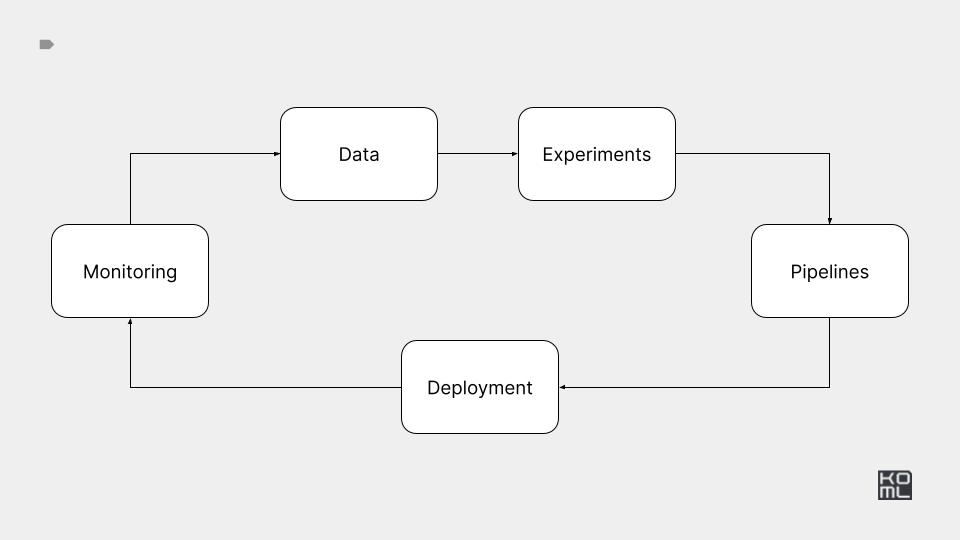

# Module 1



# Practice 

*** 

[Practice task](./PRACTICE.md)

*** 

# Reference implementation

*** 

# H2: Infrastructure


# PR1:

## Build and run 

Build ml sample docker image 

```
docker build --tag app-ml:latest ./app-ml
```

Run ml sample docker container 

```
docker run -it --rm --name app-ml-test-run app-ml:latest
docker run -it --rm --name app-ml-test-run app-ml:latest python -c "import time; time.sleep(5); print(f'AUC = {0.0001}')"
```

Build web sample docker image 

```
docker build --tag app-web:latest ./app-web
```

Build web sample docker image 

```
docker run -it --rm -p 8080:8080 --name app-web-test-run app-web:latest
```

In a separate terminal, run the curl command to check access.

```
curl 0.0.0.0:8080
```

Bulti-build docker file, if you don't want to keep a lot of docker files.

```
docker build --tag app-web:latest --target app-web ./app-multi-build
docker build --tag app-ml:latest --target app-ml ./app-multi-build
```

## Share

Login to docker registry 

```
export GITHUB_TOKEN=token
export GITHUB_USER=user
echo $GITHUB_TOKEN | docker login ghcr.io -u $GITHUB_USER --password-stdin
```

Tag images


```
docker tag app-ml:latest ghcr.io/kyryl-opens-ml/app-ml:latest
docker tag app-web:latest ghcr.io/kyryl-opens-ml/app-web:latest
```


Push image 


```
docker push ghcr.io/kyryl-opens-ml/app-ml:latest
docker push ghcr.io/kyryl-opens-ml/app-web:latest
```

## Registry

- [github](https://github.com/features/packages)
- [dockerhub](https://hub.docker.com/)
- [aws](https://aws.amazon.com/ecr/)
- [gcp](https://cloud.google.com/container-registry)

# PR2:

Check code in this file

[CI example](./../.github/workflows/module-1.yaml)

## Provides 

- [circleci](https://circleci.com/)
- [GitHub Actions](https://docs.github.com/en/actions)
- [Jenkins](https://www.jenkins.io/)
- [Travis CI](https://www.travis-ci.com/)
- [List of Continuous Integration services](https://github.com/ligurio/awesome-ci)


# PR3:

## Setup 

Install kind 
https://kind.sigs.k8s.io/docs/user/quick-start/

```
brew install kind
```

Create cluster

```
kind create cluster --name ml-in-production
```

Install kubectl

```
brew install kubectl
```

Check current context

```
kubectl config get-contexts
```

Run "htop" for k8s 

```
k9s -A
```

## Use

Create pod for app-web

```
kubectl create -f k8s-resources/pod-app-web.yaml
```

Create pod for app-ml

```
kubectl create -f k8s-resources/pod-app-ml.yaml
```

Create job for app-ml

```
kubectl create -f k8s-resources/job-app-ml.yaml
```

Create deployment for app-web

```
kubectl create -f k8s-resources/deployment-app-web.yaml
```

To access use port-forwarding 

```
kubectl port-forward svc/deployments-app-web 8080:8080
```

## Provides 

- [EKS](https://aws.amazon.com/eks/)
- [GKE](https://cloud.google.com/kubernetes-engine)
- [CloudRun](https://cloud.google.com/run)
- [AWS Fargate/ECS](https://aws.amazon.com/fargate/)


# Bonus


Sometimes Kubernetes might be overkill for your problem, for example, if you are a small team, it's a pet project, or you just don't want to deal with complex infrastructure setup. In this case, I would recommend checking out serverless offerings, some good examples of which I use all the time.

- [Railway infrastructure platform](https://railway.app/) - nice too to deploy simple app.
- [The serverless platform for AI/ML/data teams](https://modal.com/) - nice too to deploy ML heavy app.