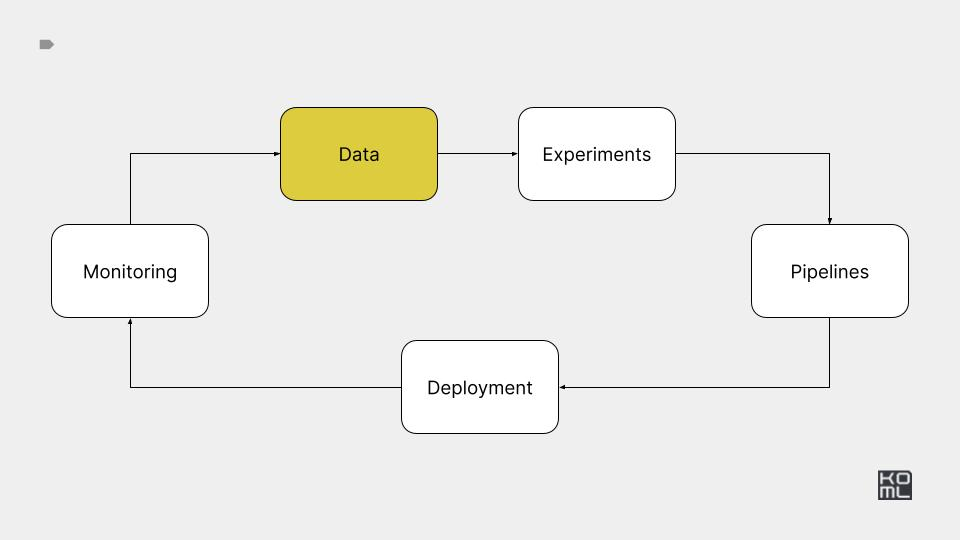

# Module 2



# Practice

[Practice task](./PRACTICE.md)

***

# Reference implementation

***


# Minio


## Setup

Create kind cluster

```bash
kind create cluster --name ml-in-production
```

Run k9s

```bash
k9s -A
```

Install libraries.

```bash
pip install -r minio_storage/requirements.txt
```


Based on https://github.com/kubernetes/examples/tree/master/staging/storage/minio

Deploy 

```
kubectl create -f minio_storage/minio-standalone-dev.yaml
```


Access UI and API 

```
kubectl port-forward --address=0.0.0.0 svc/minio-service 9000:9000

```

## S3 access to Minio


You can use Minio via AWS CLI

```
export AWS_ACCESS_KEY_ID="minio"
export AWS_SECRET_ACCESS_KEY="minio123"
```

Install AWS CLI


```
aws s3 ls --endpoint-url http://0.0.0.0:9000
aws s3api create-bucket --bucket test --endpoint-url http://0.0.0.0:9000
aws s3 cp minio_storage/minio-standalone-dev.yaml s3://test/minio-standalone-dev.yaml --endpoint-url http://0.0.0.0:9000
```


## Minio Client 

Run unit tests with minio client.

```
pytest -ss ./minio_storage/test_minio_client.py
```

# Vector db 


Install libraries.

```
pip install -r vector-db/requirements.txt
```

Create database.

```
python vector-db/rag_cli_application.py create-new-vector-db --table-name test --number-of-documents 300
```

Query database.

```
python vector-db/rag_cli_application.py query-existing-vector-db  --query 'complex query' --table-name test
```


# CVS inference performance

Setup

```
pip install -r processing/requirements.txt
```

Run experiments. 


```
python processing/inference_example.py run-single-worker --inference-size 10000000
python processing/inference_example.py run-pool --inference-size 10000000
python processing/inference_example.py run-ray --inference-size 10000000
python processing/inference_example.py run-dask --inference-size 10000000
```

Results. 

| Name of Inference    | Time (seconds)      |
|----------------------|---------------------|
| Inference 1 worker   | 10.327570502005983  |
| Inference 16 workers | 0.9792796869878657  |
| Inference with Ray   | 1.3987669470079709  |
| Inference with Dask  | 1.2243085630179849  |


# Pandas profiling 

https://aaltoscicomp.github.io/python-for-scicomp/data-formats/


# Streaming dataset

- https://www.tensorflow.org/tutorials/load_data/tfrecord
- https://github.com/aws/amazon-s3-plugin-for-pytorch
- https://pytorch.org/blog/efficient-pytorch-io-library-for-large-datasets-many-files-many-gpus/
- https://github.com/webdataset/webdataset
- https://github.com/mosaicml/streaming


Create
```
python tutorial.py create-data --path-to-save random-data
```

Upload

```
aws s3api create-bucket --bucket datasets --endpoint-url $AWS_ENDPOINT
aws s3 cp --recursive random-data s3://datasets/random-data --endpoint-url $AWS_ENDPOINT
```

Read

```
python tutorial.py get-dataloader --path-to-save random-data
```


# DVC


Init DVC

```
dvc init --subdir
git status
git commit -m "Initialize DVC"
```

Add data 

```
mkdir data
touch ./data/big-data.csv
```

Add to dvc

```
dvc add ./data/big-data.csv
git add data/.gitignore data/big-data.csv.dvc
git commit -m "Add raw data"
```

Add remote 

```
aws s3api create-bucket --bucket ml-data --endpoint-url $AWS_ENDPOINT

dvc remote add -d minio s3://ml-data
dvc remote modify minio endpointurl $AWS_ENDPOINT
```

Save code to git 

```
git add .dvc/config
git commit -m "Configure remote storage"
git push 
```

Save data to storage

```
export AWS_ACCESS_KEY_ID=minioadmin
export AWS_SECRET_ACCESS_KEY=minioadmin
dvc push
```

- https://dvc.org/doc/start/data-management
- https://github.com/iterative/dataset-registry


# Labeling: Label-studio and RLHF

```
docker run -it -p 8080:8080 -v `pwd`/mydata:/label-studio/data heartexlabs/label-studio:latest
```

```
python generate_mock_rlhf_dataset.py
```

Reference:

- https://labelstud.io/blog/create-a-high-quality-rlhf-dataset/
- https://github.com/HumanSignal/RLHF
- https://github.com/huggingface/trl
- https://huggingface.co/google/flan-t5-base
- https://docs.argilla.io/en/latest/tutorials_and_integrations/tutorials/feedback/train-reward-model-rlhf.html


## RAG Labeling: Argilla

```
docker run -d --name argilla -p 6900:6900 argilla/argilla-quickstart:latest
```

https://docs.argilla.io/en/latest/tutorials_and_integrations/tutorials/feedback/fine-tuning-openai-rag-feedback.html


