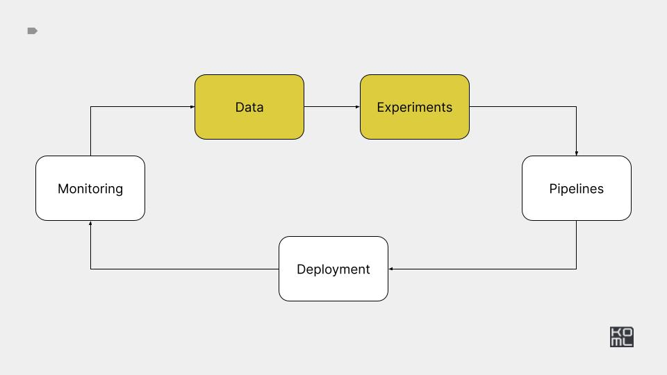

# Module 3



# Practice

[Practice task](./PRACTICE.md)

***

# Reference implementation

***

## Project stucture

- [Python project](https://github.com/navdeep-G/samplemod.git)
- [ML project](https://github.com/ashleve/lightning-hydra-template.git)
- [Advanced features](https://github.com/Lightning-AI/lightning)

## Styling

[ruff](https://github.com/astral-sh/ruff)


## Configuration

[hydra](https://hydra.cc/docs/intro/)

## Experiments management

https://neptune.ai/blog/best-ml-experiment-tracking-tools

## Model card

- [Model Cards for Model Reporting](https://arxiv.org/abs/1810.03993)
- [A collection of machine learning model cards and datasheets.](https://github.com/ivylee/model-cards-and-datasheets)
- [GPT-4o](https://openai.com/index/hello-gpt-4o/)
- [GPT-4 System Card](https://cdn.openai.com/papers/gpt-4-system-card.pdf)

## Classic example: BERT-based training

[classic-example](./classic-example)

https://huggingface.co/models?sort=downloads

## Modern example: GenAI-based training

[generative_example](./generative_example)

- https://huggingface.co/microsoft/Phi-3-mini-128k-instruct/tree/main
- https://github.com/microsoft/Phi-3CookBook
- https://huggingface.co/spaces/open-llm-leaderboard/open_llm_leaderboard

## LLM API

Run API LLMs

```bash
python generative-api/pipeline_api.py ./data/test.json
```

Run open LLMs

```bash
python generative-api/pipeline_phi3.py ./data/test.json
```

## LLM API testing


- [deepeval](https://github.com/confident-ai/deepeval)
- [promptfoo](https://github.com/promptfoo/promptfoo)
- [LLM Testing in 2024: Top Methods and Strategies](https://www.confident-ai.com/blog/llm-testing-in-2024-top-methods-and-strategies)
- [uptrain](https://github.com/uptrain-ai/uptrain)
- [ragas](https://github.com/explodinggradients/ragas)
- [NeMo Guardrails](https://github.com/NVIDIA/NeMo-Guardrails)
- [Automated Unit Test Improvement using Large Language Models at Meta](https://arxiv.org/abs/2402.09171)


# Distributed training

- https://www.anyscale.com/blog/what-is-distributed-training
- https://www.anyscale.com/blog/training-175b-parameter-language-models-at-1000-gpu-scale-with-alpa-and-ray
- https://huggingface.co/docs/transformers/perf_train_gpu_many
- https://github.com/microsoft/DeepSpeed


# Hyperparameter search & AutoML

- https://github.com/microsoft/nni
- https://github.com/autogluon/autogluon


## Updated design doc

[Google doc](https://docs.google.com/document/d/1vkjE5QohSkxkcWCWahciqR43K4RjCjXMpixx3hoYjXo/edit?usp=sharing)
