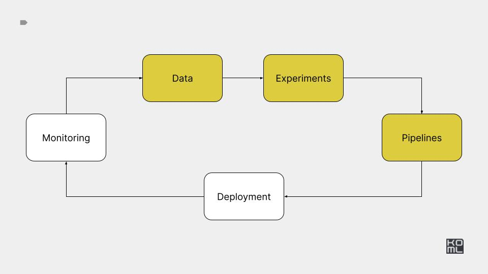

# Module 4



# Practice 

[Practice task](./PRACTICE.md)

***

# Reference implementation

***

# Setup

Create kind cluster

```bash
kind create cluster --name ml-in-production
```

Run k9s

```bash
k9s -A
```

# Airflow

Install

```bash
AIRFLOW_VERSION=2.9.3
PYTHON_VERSION="$(python --version | cut -d " " -f 2 | cut -d "." -f 1-2)"
CONSTRAINT_URL="https://raw.githubusercontent.com/apache/airflow/constraints-${AIRFLOW_VERSION}/constraints-${PYTHON_VERSION}.txt"
pip install "apache-airflow==${AIRFLOW_VERSION}" --constraint "${CONSTRAINT_URL}"
pip install apache-airflow-providers-cncf-kubernetes==8.3.3
```

Run standalone airflow

```bash
export AIRFLOW_HOME=$PWD/airflow_pipelines
export AIRFLOW__CORE__LOAD_EXAMPLES=False
export WANDB_PROJECT=****************
export WANDB_API_KEY=****************
airflow standalone
```

Create storage

```bash
kubectl create -f ./airflow_pipelines/volumes.yaml
```

Open UI

```bash
open http://0.0.0.0:8080
```

Trigger training job.

```bash
airflow dags trigger training_dag
```

Trigger 5 training jobs.

```bash
for i in {1..5}; do airflow dags trigger training_dag; sleep 1; done
```

Trigger inference job.

```bash
airflow dags trigger inference_dag
```

Trigger 5 inference jobs.

```bash
for i in {1..5}; do airflow dags trigger inference_dag; sleep 1; done
```

### References:

- [AI + ML examples of DAGs](https://registry.astronomer.io/dags?categoryName=AI+%2B+Machine+Learning&limit=24&sorts=updatedAt%3Adesc)
- [Pass data between tasks](https://www.astronomer.io/docs/learn/airflow-passing-data-between-tasks)


# Kubeflow pipelines

Install

```bash
export WANDB_PROJECT=****************
export WANDB_API_KEY=****************
export PIPELINE_VERSION=2.2.0
kubectl apply -k "github.com/kubeflow/pipelines/manifests/kustomize/cluster-scoped-resources?ref=$PIPELINE_VERSION"
kubectl wait --for condition=established --timeout=60s crd/applications.app.k8s.io
kubectl apply -k "github.com/kubeflow/pipelines/manifests/kustomize/env/dev?ref=$PIPELINE_VERSION"
```


Access UI and minio

```bash
kubectl port-forward --address=0.0.0.0 svc/minio-service 9000:9000 -n kubeflow
kubectl port-forward --address=0.0.0.0 svc/ml-pipeline-ui 3000:80 -n kubeflow
```

Create training job.

```bash
python ./kubeflow_pipelines/kfp_training_pipeline.py http://0.0.0.0:3000
```

Create inference job.

```bash
python  kubeflow_pipelines/kfp_inference_pipeline.py http://0.0.0.0:3000
```


### References

- [Create, use, pass, and track ML artifacts](https://www.kubeflow.org/docs/components/pipelines/v2/data-types/artifacts/#new-pythonic-artifact-syntax)
- [Vertex AI](https://cloud.google.com/vertex-ai/docs/pipelines/introduction)


# Dagster


Setup

```bash
mkdir ./dagster_pipelines/dagster-home
export DAGSTER_HOME=$PWD/dagster_pipelines/dagster-home
export WANDB_PROJECT=****************
export WANDB_API_KEY=****************
```

Deploy modal functions

```bash
MODAL_FORCE_BUILD=1 modal deploy ./dagster_pipelines/text2sql_functions.py
```

Run Dagster

```bash
dagster dev -f dagster_pipelines/text2sql_pipeline.py -p 3000 -h 0.0.0.0
```

### References:

- [Introducing Asset Checks](https://dagster.io/blog/dagster-asset-checks)
- [Anomaly Detection](https://dagster.io/glossary/anomaly-detection)