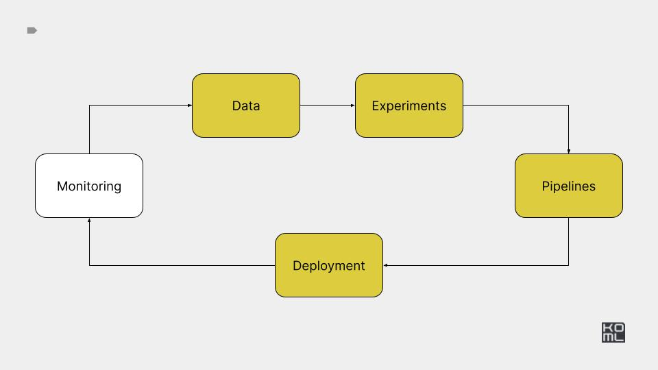

# Module 6



## Overview

This module covers benchmarking, autoscaling and model optimization
techniques such as quantization.

## Practice

[Practice task](./PRACTICE.md)

---

## Reference implementation

---


# Setup

Create kind cluster

```bash
kind create cluster --name ml-in-production
```

Run k9s

```bash
k9s -A
```


# Setup 


```
export WANDB_API_KEY='your key here'
kubectl create secret generic wandb --from-literal=WANDB_API_KEY=$WANDB_API_KEY
```


# Benchmarking

NOTE: **Premature optimization is the root of all evil!**

Deploy API from module 5

```
kubectl create -f ./k8s/app-fastapi.yaml
kubectl create -f ./k8s/app-triton.yaml
kubectl create -f ./k8s/app-streamlit.yaml
kubectl create -f ./k8s/kserve-inferenceserver.yaml
```

```
kubectl port-forward --address 0.0.0.0 svc/app-fastapi 8080:8080
kubectl port-forward --address 0.0.0.0 svc/app-streamlit 8080:8080
```

Run load test via locust

```
locust -f load-testing/locustfile.py --host=http://0.0.0.0:8080 --users 50 --spawn-rate 10 --autostart --run-time 600s
```

Run load test via k6

```
K6_WEB_DASHBOARD=true k6 run ./load-testing/load_test.js
```

Run on k8s 

```
kubectl create -f ./k8s/vegeta-job.yaml
```

- https://github.com/locustio/locust
- https://github.com/grafana/k6
- https://github.com/gatling/gatling
- https://ghz.sh/
- https://github.com/tsenart/vegeta


# Vertical scaling

- https://github.com/kubernetes/autoscaler/tree/master/vertical-pod-autoscaler
- https://docs.railway.app/reference/scaling 

# Horizontal scaling

- https://kubernetes.io/docs/concepts/configuration/manage-resources-containers/

Install metric server 

```
kubectl apply -f https://github.com/kubernetes-sigs/metrics-server/releases/latest/download/components.yaml
kubectl patch -n kube-system deployment metrics-server --type=json -p '[{"op":"add","path":"/spec/template/spec/containers/0/args/-","value":"--kubelet-insecure-tls"}]'
```

Update deployment 

```
kubectl apply -f k8s/app-fastapi-resources.yaml
```


Create from cli

```
kubectl autoscale deployment app-fastapi --cpu-percent=50 --min=1 --max=10
```

Create from yaml

```
kubectl create -f ./k8s/app-fastapi-hpa.yaml
```


- https://kubernetes.io/docs/tasks/run-application/horizontal-pod-autoscale/
- https://kubernetes.io/docs/tasks/run-application/horizontal-pod-autoscale-walkthrough/
- https://kserve.github.io/website/master/modelserving/autoscaling/autoscaling/


KNative autoscaling: https://kserve.github.io/website/master/modelserving/autoscaling/autoscaling/

```
kubectl create -f ./k8s/kserve-inferenceserver-autoscaling.yaml
```


```
seq 1 1000 | xargs -n1 -P10 -I {} curl -v -H "Host: custom-model-autoscaling.default.example.com" \
-H "Content-Type: application/json" \
"http://localhost:8080/v1/models/custom-model:predict" \
-d @data-samples/kserve-input.json
```

# Async inferece 


#### Simple example 

```
modal deploy ./queue/simple_queue.py
python queue/simple_queue.py
```

#### SQS example 

Setup SQS

```
git clone https://github.com/poundifdef/smoothmq.git
docker build -t sqs:latest ./smoothmq/
docker run -p 3000:3000 -p 3001:3001 sqs:latest 
```

Run web
```
export AWS_ACCESS_KEY_ID=DEV_ACCESS_KEY_ID
export AWS_SECRET_ACCESS_KEY=DEV_SECRET_ACCESS_KEY
export AWS_DEFAULT_REGION=us-east-1

python ./queue/sqs_queue.py run-api
```

Run worker

```
export AWS_ACCESS_KEY_ID=DEV_ACCESS_KEY_ID
export AWS_SECRET_ACCESS_KEY=DEV_SECRET_ACCESS_KEY
export AWS_DEFAULT_REGION=us-east-1

python ./queue/sqs_queue.py run-worker
```


Seldon V2 Examples: https://docs.seldon.io/projects/seldon-core/en/v2/contents/architecture/index.html
Kafka: https://kserve.github.io/website/master/modelserving/kafka/kafka/


## Model optimization


### Quatization 

- Hardware: EC2 g5.4xlarge (1 GPU A10, 16 vCPU, 64 GB RAM, $1.624 hour) [docs](https://aws.amazon.com/ec2/instance-types/g5/)
- Concurrent users: 100
- Data: https://huggingface.co/datasets/gretelai/synthetic_text_to_sql


| Approach   |   Median Response Time |   95% |   98% | F1
|:-----------|-----------------------:|------:|------:|
| default    |                   5600 |  6200 |  6300 |
| eetq       |                   5000 |  5700 |  5900 |
| fp8        |                   5000 |  5800 |  6000 |
| 4-bit-nf4  |                   8500 |  9200 |  9400 |
| 8-bit      |                  13000 | 14000 | 14000 |
| 4-bit-fp4  |                   8600 |  9300 |  9400 |

Add metrics & GPU unitization

```bash
docker run --gpus all --shm-size 1g -p 8005:80 -v $PWD/data:/data ghcr.io/huggingface/text-generation-inference:2.3.0 --model-id microsoft/Phi-3.5-mini-instruct
locust -f load_test.py -u 100 -r 10  --headless --run-time 5m --host=http://0.0.0.0:8005 --csv raw_data/default.csv --html raw_data/default.html


docker run --gpus all --shm-size 1g -p 8005:80 -v $PWD/data:/data ghcr.io/huggingface/text-generation-inference:2.3.0 --model-id microsoft/Phi-3.5-mini-instruct --quantize eetq
locust -f load_test.py -u 100 -r 10  --headless --run-time 5m --host=http://0.0.0.0:8005 --csv raw_data/eetq.csv --html raw_data/eetq.html


docker run --gpus all --shm-size 1g -p 8005:80 -v $PWD/data:/data ghcr.io/huggingface/text-generation-inference:2.3.0 --model-id microsoft/Phi-3.5-mini-instruct --quantize bitsandbytes 
locust -f load_test.py -u 100 -r 10  --headless --run-time 5m --host=http://0.0.0.0:8005 --csv raw_data/8-bit.csv --html raw_data/8-bit.html


docker run --gpus all --shm-size 1g -p 8005:80 -v $PWD/data:/data ghcr.io/huggingface/text-generation-inference:2.3.0 --model-id microsoft/Phi-3.5-mini-instruct --quantize bitsandbytes-fp4
locust -f load_test.py -u 100 -r 10  --headless --run-time 5m --host=http://0.0.0.0:8005 --csv raw_data/4-bit-fp4.csv --html raw_data/4-bit-fp4.html


docker run --gpus all --shm-size 1g -p 8005:80 -v $PWD/data:/data ghcr.io/huggingface/text-generation-inference:2.3.0 --model-id microsoft/Phi-3.5-mini-instruct --quantize bitsandbytes-nf4
locust -f load_test.py -u 100 -r 10  --headless --run-time 5m --host=http://0.0.0.0:8005 --csv raw_data/4-bit-nf4.csv --html raw_data/4-bit-nf4.html


docker run --gpus all --shm-size 1g -p 8005:80 -v $PWD/data:/data ghcr.io/huggingface/text-generation-inference:2.3.0 --model-id microsoft/Phi-3.5-mini-instruct --quantize fp8
locust -f load_test.py -u 100 -r 10  --headless --run-time 5m --host=http://0.0.0.0:8005 --csv raw_data/fp8.csv --html raw_data/fp8.html
```


https://docs.vllm.ai/en/latest/quantization/supported_hardware.html
https://huggingface.co/docs/text-generation-inference/en/conceptual/quantization
https://www.adyen.com/knowledge-hub/llm-inference-at-scale-with-tgi


### Accelerators

https://modal.com/docs/examples/trtllm_llama


### Distillation

https://github.com/intel/neural-compressor/tree/master/examples/pytorch/nlp/huggingface_models/text-classification/distillation/eager

### Pruning

https://github.com/intel/neural-compressor/tree/master/examples/pytorch/nlp/huggingface_models/text-classification/pruning/eager


- https://github.com/huggingface/transformers/tree/main/examples/research_projects/distillation
- https://github.com/huggingface/distil-whisper/
- https://github.com/intel/neural-compressor
- https://github.com/neuralmagic/sparseml
- https://github.com/microsoft/fastformers

