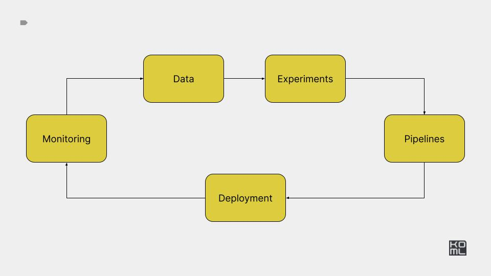

# Module 7



# Practice 

[Practice task](./PRACTICE.md)

*** 

# Reference implementation

*** 


# Setup 

Create kind cluster 

```
kind create cluster --name ml-in-production
```

Run k9s 

```
k9s -A
```


# Grafana 


```
helm repo add prometheus-community https://prometheus-community.github.io/helm-charts
helm repo update
helm install monitoring prometheus-community/kube-prometheus-stack

kubectl port-forward --address 0.0.0.0 svc/monitoring-grafana 3000:80
admin/prom-operator

helm uninstall monitoring 
```

- Reference: https://github.com/prometheus-community/helm-charts/blob/main/charts/kube-prometheus-stack/README.md


# Data monitoring 

- https://github.com/evidentlyai/evidently
- https://github.com/SeldonIO/alibi-detect
- https://github.com/whylabs/whylogs
- https://github.com/GokuMohandas/monitoring-ml


## Seldon: Monitoring and explainability of models in production


[Monitoring and explainability of models in production](https://arxiv.org/abs/2007.06299)
[Desiderata for next generation of ML model serving](https://arxiv.org/abs/2210.14665)


Setup seldon 

https://github.com/SeldonIO/seldon-core/tree/v2/ansible


Ansible install 

```
pip install ansible openshift docker passlib
ansible-galaxy collection install git+https://github.com/SeldonIO/ansible-k8s-collection.git
```


Clone repo 

```
git clone https://github.com/SeldonIO/seldon-core --branch=v2

ansible-playbook playbooks/kind-cluster.yaml
ansible-playbook playbooks/setup-ecosystem.yaml
ansible-playbook playbooks/setup-seldon.yaml
```

CLI client 

```
wget https://github.com/SeldonIO/seldon-core/releases/download/v2.7.0-rc1/seldon-linux-amd64
mv seldon-linux-amd64 seldon
chmod u+x seldon
sudo mv ./seldon /usr/local/bin/seldon
```

Port-forward

```
kubectl port-forward --address 0.0.0.0 svc/seldon-mesh -n seldon-mesh 9000:80
kubectl port-forward --address 0.0.0.0 svc/seldon-scheduler -n seldon-mesh 9004:9004
```

Simple test 

```
seldon model load -f seldon-examples/model-iris.yaml --scheduler-host 0.0.0.0:9004
seldon model infer iris '{"inputs": [{"name": "predict", "shape": [1, 4], "datatype": "FP32", "data": [[1, 2, 3, 4]]}]}' --inference-host 0.0.0.0:9000

seldon model load -f seldon-examples/tfsimple1.yaml --scheduler-host 0.0.0.0:9004
seldon model infer tfsimple1 --inference-host 0.0.0.0:9000 '{"inputs":[{"name":"INPUT0","data":[1,2,3,4,5,6,7,8,9,10,11,12,13,14,15,16],"datatype":"INT32","shape":[1,16]},{"name":"INPUT1","data":[1,2,3,4,5,6,7,8,9,10,11,12,13,14,15,16],"datatype":"INT32","shape":[1,16]}]}'
```

Simple drift 

https://docs.seldon.io/projects/seldon-core/en/v2/contents/examples/income.html

```
seldon model load -f seldon-examples/pipeline/income-preprocess.yaml --scheduler-host 0.0.0.0:9004
seldon model load -f seldon-examples/pipeline/income.yaml --scheduler-host 0.0.0.0:9004
seldon model load -f seldon-examples/pipeline/income-drift.yaml --scheduler-host 0.0.0.0:9004
seldon model load -f seldon-examples/pipeline/income-outlier.yaml --scheduler-host 0.0.0.0:9004
seldon pipeline load -f seldon-examples/pipeline/income-outlier.yaml --scheduler-host 0.0.0.0:9004
seldon pipeline list
```


## Seldon & Kserve

- https://docs.seldon.io/projects/seldon-core/en/latest/analytics/outlier_detection.html
- https://docs.seldon.io/projects/seldon-core/en/latest/analytics/drift_detection.html


## LLM Observability

- https://fullstackdeeplearning.com/llm-bootcamp/spring-2023/llmops/
- https://www.gantry.io/
- https://arize.com/
- https://github.com/Arize-ai/phoenix
- https://www.rungalileo.io/
- https://www.vellum.ai/
- https://smith.langchain.com
- https://www.arthur.ai/
- https://docs.wandb.ai/guides/weave/prod-mon
- https://www.comet.com/site/
- https://mlflow.org/
- https://getnomos.com/
- https://www.modo.ai/
- https://www.nebuly.com/
- https://github.com/traceloop/openllmetry
- https://github.com/evidentlyai/ml_observability_course


