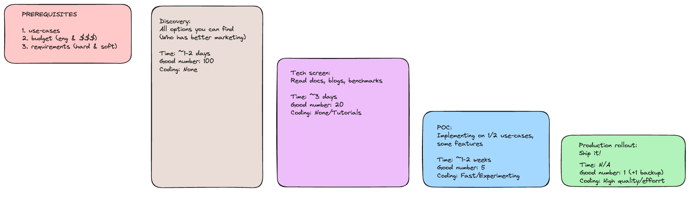
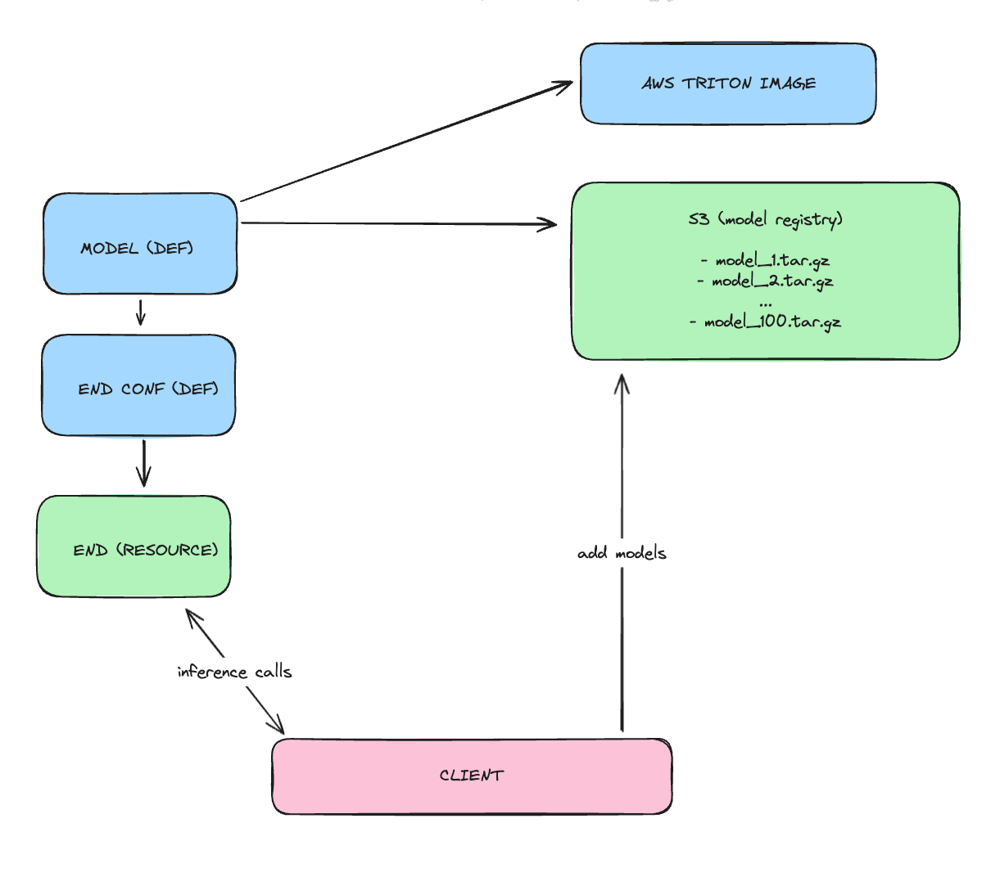

# Module 8


## Overview

Explore buy vs build decisions and deploy multi-model endpoints on AWS
SageMaker and GCP Vertex AI.

## Practice

[Practice task](./PRACTICE.md)

---

## Reference implementation

---

## Buy vs Build 



## AWS example

- Infra: AWS
- Data: S3 + RDS
- Experiments: EC2 + [SageMaker Processing Jobs](https://sagemaker-examples.readthedocs.io/en/latest/sagemaker_processing/scikit_learn_data_processing_and_model_evaluation/scikit_learn_data_processing_and_model_evaluation.html)
- Pipelines: [MWAA](https://aws.amazon.com/managed-workflows-for-apache-airflow/)
- Basic deployment: [SageMaker Inference Toolkit](https://github.com/aws/sagemaker-inference-toolkit)
- Advance deployment: [Asynchronous inference](https://docs.aws.amazon.com/sagemaker/latest/dg/async-inference.html) + [Multi-model endpoints](https://docs.aws.amazon.com/sagemaker/latest/dg/multi-model-endpoints.html)
- Monitoring: [SageMaker Model Monitor](https://docs.aws.amazon.com/sagemaker/latest/dg/model-monitor.html)


## SageMaker Advance Multi-model endpoints



Create

```
python cli.py create-endpoint
```

Add

```
python cli.py add-model ./model_registry/add_sub/ add_sub_v0.tar.gz
python cli.py add-model ./model_registry/triton-serve-pt/ triton-serve-pt_v0.tar.gz
```

Note: make sure you have model_registry: https://github.com/triton-inference-server/python_backend


Check

```
aws s3 ls s3://sagemaker-us-east-1-469651751916/models/
```

Call 

```
python cli.py call-model-image triton-serve-pt_v0.tar.gz
python cli.py call-model-vector add_sub_kyryl-dev.tar.gz
```


Clean all
```
bash ./sagemaker-multimodal/clean.sh
```


## Tech radar

```
python -m http.server 9000
```

- https://github.com/zalando/tech-radar
- https://tech-radar.preply.com/

